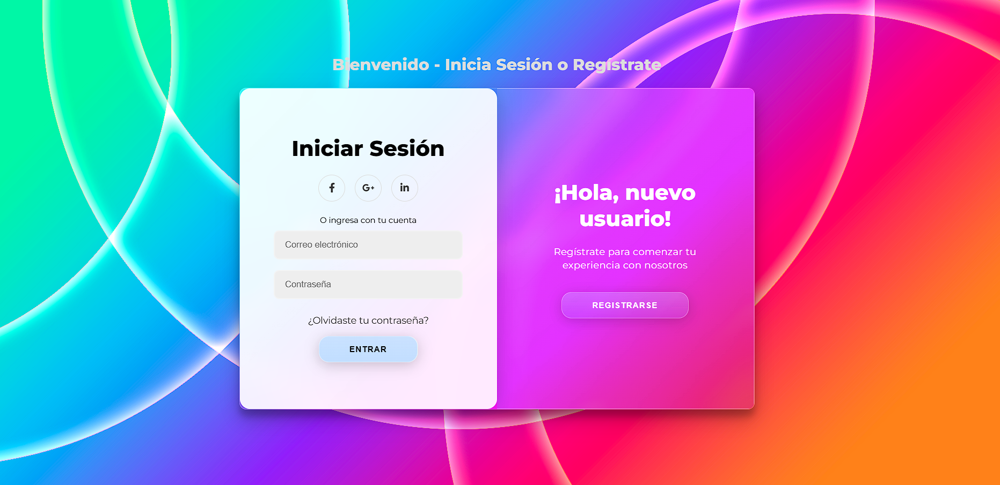
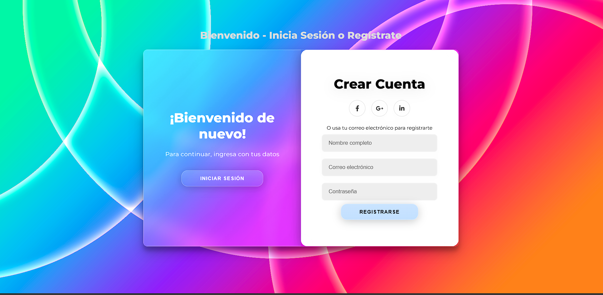

# Login Responsive con Efecto Cristal Líquido 

Alumno: Guzman Jimenez Alary

## Descripción

Este proyecto consiste en la creación de un sistema de Login utilizando **HTML**, **CSS** y **JavaScript**, aplicando un efecto visual moderno tipo *Cristal Líquido* (Glassmorphism) y transiciones animadas. Además, se incluye un panel para **registro de usuarios**, validaciones básicas en el cliente y enlaces simulados a redes sociales. El diseño es responsivo y se optimiza visualmente usando Bootstrap (solo para layout si se desea).

---

## Estructura del Proyecto

```
│   README.md
│   index.html                  # Página principal (Login/Registro)
│
├── css/
│      login.css                # Hoja de estilos principal (efecto cristal líquido incluido)
│
├── js/
│      login.js                 # Archivo de lógica JS para cambios de panel y validaciones
│
└── img/
       img1.jpg                 # Imagen de fondo
       iconos redes sociales    # Otros recursos visuales opcionales
```

---

## Tecnologías Utilizadas

* HTML5  
* CSS3 (con Glassmorphism)  
* JavaScript Puro  
*Bootstrap (opcional, no obligatorio, solo para diseño)  

---

## Funcionamiento Principal

El sistema incluye:

- **Panel Animado**: Cambia entre *Inicio de Sesión* y *Registro* con efecto deslizante.
- **Efecto Cristal Líquido**: Aplicado sobre formularios, botones y panel lateral.
- **Validaciones en el Cliente**:
  - Campos obligatorios.
  - Contraseñas con mínimo 8 caracteres.
- **Redirección Simulada**: Botones de redes llevan a las páginas oficiales de login (Facebook, Google, LinkedIn).
  
**JavaScript Destacado**:

```js
const btnRegistrar = document.getElementById('btn-registrar');
const btnIniciar = document.getElementById('btn-iniciar');
const contenedor = document.getElementById('contenedor-principal');

btnRegistrar.addEventListener('click', () => {
    contenedor.classList.add("panel-activo");
});
btnIniciar.addEventListener('click', () => {
    contenedor.classList.remove("panel-activo");
});

document.getElementById('btn-enviar-registro').addEventListener('click', () => {
    const nombre = document.querySelector('.registrar input[type="text"]').value.trim();
    const email = document.querySelector('.registrar input[type="email"]').value.trim();
    const password = document.querySelector('.registrar input[type="password"]').value.trim();

    if (nombre === '' || email === '' || password === '') {
        alert('Por favor, completa todos los campos.');
        return;
    }
    if (password.length < 8) {
        alert('La contraseña debe tener al menos 8 caracteres.');
        return;
    }
    alert('Registro exitoso');
});
```

---

## Estilos CSS Principales

Ejemplo:

```css
.contenedor-principal {
    background: linear-gradient(135deg, rgba(255,255,255,0.15), rgba(255,255,255,0.05));
    backdrop-filter: blur(20px) saturate(180%);
    border: 1px solid rgba(255,255,255,0.3);
    border-radius: 10px;
}
```

---

## Capturas de Pantalla

### Pantalla Inicial



### Registro



---

## GitHub Pages

Puedes visualizar el proyecto en funcionamiento en:  
**[Ver Demo en GitHub Pages](https://alaryguzman.github.io/Login/)**

---

## Notas Finales

* Proyecto sin frameworks complejos.  
* Ideal para prácticas de diseño moderno y validaciones simples.  
* Recomendado para portafolios académicos o ejercicios de frontend.  
